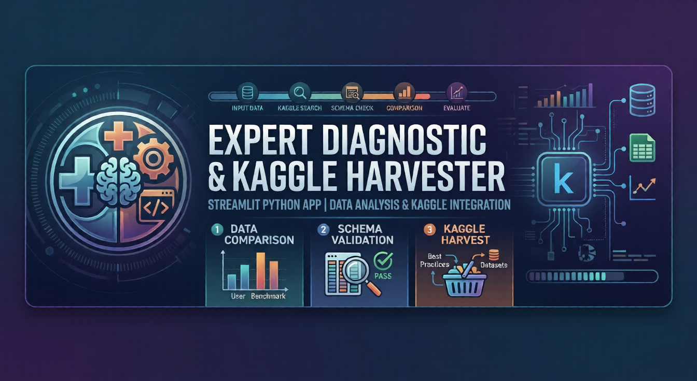

<div align="center">
  
  
  <h1 align="center">Comparative Analysis with Kaggle</h1>

  <p align="center">
    <strong>An Industry-Agnostic AI-Powered Diagnostic & Analytics Engine</strong>
    <br />
    <br />
    <a href="#-features">Features</a>
    ·
    <a href="#%EF%B8%8F-zero-key-exposure-architecture">Security</a>
    ·
    <a href="#-installation--setup">Setup</a>
    ·
    <a href="#-dynamic-logic-flow">How it Works</a>
  </p>

  <p align="center">
    <a href="https://kaggle-data.streamlit.app"></a>
    
    
    
    
    
  </p>
</div>

<br />

<div align="center">
  
</div>

## 📖 Overview

**Comparative Analysis with Kaggle** is an advanced, automated expert audit application built with Streamlit. It allows users to cross-reference their telemetry data, lab results, or manual symptoms against the vast global datasets hosted on Kaggle.

Whether you are in **Mechanical Engineering**, **Medical Diagnostics**, or **Financial Analysis**, this tool provides context to your data by downloading relevant benchmarks, applying fuzzy schema mapping, running deep Z-score statistics, and synthesizing the findings using a customizable LLM Reasoning Engine.

---

## ✨ Features

- **🧠 Dynamic LLM Reasoning Engine**: Automatically generates highly optimized Kaggle search queries based on your symptoms, selected category, and data headers.
- **📝 Text-Based AI Diagnostics**: No data? No problem. Describe your scenario (e.g., *"I'm feeling dizzy after meals"*), and the LLM will harvest a relevant dataset and compare your symptoms against the dataset's structural patterns.
- **📊 Statistical Benchmarking**: If a file is uploaded (CSV/Excel/JSON/PDF/DOCX/DOC), the app calculates Z-scores against the Kaggle benchmark to detect and isolate numerical anomalies.
- **🎨 Interactive Visualizations**: Features overlaid probability density histograms and box plots built with Plotly.
- **💾 Export & Download**: Export your fully processed data, enriched with Z-scores and anomaly flags.
- **⚡ Caching & Proxy Layer**: Employs Streamlit caching to prevent redundant API calls, saving time and tokens. Advanced users can also route LLM requests through local HTTP/HTTPS proxies.

---

## 🛡️ Zero-Key Exposure Architecture

Security is paramount. As an end-user of this application, **you do not need a Kaggle account or an API key** to use the tool. The application is securely pre-configured.

The developer has implemented a strictly backend-only credential pipeline. This means the Kaggle API keys are safely injected by the host environment, completely preventing any accidental screen-share exposure or source-code leaks. End-users can simply launch the app and enjoy full access to Kaggle's datasets automatically.

---

## 🚀 Installation & Setup

### 1. Clone the Repository
```bash
git clone https://github.com/saeedangiz1/Kaggle-Data-Comparison.git
cd Kaggle-Data-Comparison
```

### 2. Install Dependencies
Make sure you have Python 3.11+ installed.
```bash
pip install -r requirements.txt
```

### 3. Run the Application
Because the Kaggle credentials have already been securely configured by the developer, you can skip any API key setup! Just run:
```bash
streamlit run app.py
```

---

## 📖 User Manual: LLM Configuration

The reasoning engine requires an LLM to generate queries and synthesize diagnostic data. You can configure this dynamically in the sidebar using either a local model or a cloud provider.

### Option A: Local & Private (Ollama)
If you have a powerful machine and want 100% data privacy, use Ollama.
1. Download and install [Ollama](https://ollama.com/).
2. Open your terminal and run a model (e.g., `ollama run llama3`).
3. In the App Sidebar, select **LLM Provider**: `Ollama (Local/Custom)`.
4. **Endpoint URL**: `http://localhost:11434`
5. **Model Name**: `llama3` (or whichever model you pulled).
6. **API Key**: *Leave blank.*

### Option B: Cloud Power (OpenRouter)
If you want to use the world's most powerful models (like Claude 3 Opus, GPT-4o, or Llama 3 70B) without local hardware requirements, use OpenRouter.
1. Create an account at [OpenRouter.ai](https://openrouter.ai/) and generate an API key.
2. In the App Sidebar, select **LLM Provider**: `OpenAI-Compatible REST`.
3. **Endpoint URL**: `https://openrouter.ai/api/v1`
4. **Model Name**: e.g., `anthropic/claude-3-opus` or `qwen/qwen3-next-80b-a3b-instruct:free` or `minimax/minimax-m2.5:free` or `google/gemma-4-31b-it:free`.
5. **API Key**: Paste your OpenRouter key (`sk-or-v1-...`).

---

## 🧠 Dynamic Logic Flow

The system processes logic through multiple adaptive pathways depending on what you provide:

1. **Input Context:** Select a domain (e.g., *Medical Diagnostics*) and provide manual symptoms in the text box.
2. **AI Query Synthesis:** The LLM generates a precise Kaggle search query from your text and category.
3. **Harvesting:** The application interacts with the Kaggle API to pull the most relevant dataset down to your local machine instantly.
4. **Intelligent Diagnostics:** The LLM reads the statistical summary of the Kaggle dataset and compares it directly against your manual symptoms to provide comparative insights.
5. **(Optional) Hard Data Comparison:** If you also uploaded a file, the system fuzzy-matches your columns to the Kaggle columns (>80% confidence requirement) and computes Z-score distributions for deep anomaly detection.

<br />

<div align="center">
  
  <br />
  <sub>Created by Mohammad Saeed Angiz</sub>
</div>
